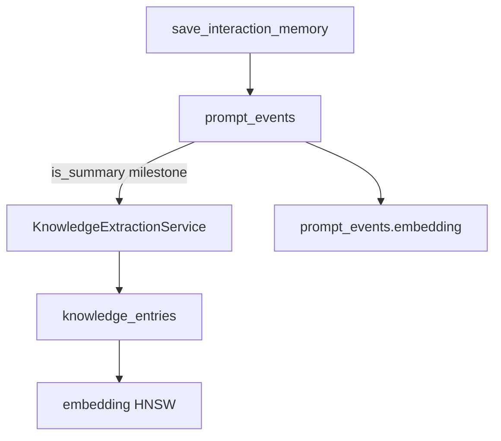

# knowledge_entries — Especificación de ingestión y búsqueda (Fase C)

> **Estado:** diseño aprobado, implementación pendiente.  
> **Prerequisito:** no crear la tabla hasta implementar el pipeline descrito aquí.

## Objetivo

Separar dos capas de memoria del proyecto:

| Capa | Tabla | Contenido | Uso |
|------|-------|-----------|-----|
| Historial conversacional | `prompt_events` | Turnos crudos + resúmenes rolling/milestone | Timeline, auditoría, generación de contexto inmediato |
| Conocimiento consolidado | `knowledge_entries` | Hechos, decisiones y patrones curados | RAG de largo plazo, dashboard “Knowledge”, MCP retrieval principal |

Hoy solo existe la primera capa; los embeddings viven en `prompt_events.embedding` (`is_summary=true`).

## Schema propuesto (referencia)

```sql
CREATE TABLE knowledge_entries (
  id UUID PRIMARY KEY DEFAULT gen_random_uuid(),
  project_id UUID NOT NULL REFERENCES projects(id) ON DELETE CASCADE,
  source_prompt_event_id UUID REFERENCES prompt_events(id) ON DELETE SET NULL,
  category VARCHAR(80) NOT NULL,
  content TEXT NOT NULL,
  embedding vector(768),
  created_at TIMESTAMPTZ NOT NULL DEFAULT now(),
  updated_at TIMESTAMPTZ NOT NULL DEFAULT now()
);

CREATE INDEX idx_knowledge_entries_project_created
  ON knowledge_entries(project_id, created_at DESC);

CREATE INDEX idx_knowledge_entries_embedding_cosine
  ON knowledge_entries USING hnsw (embedding vector_cosine_ops)
  WHERE embedding IS NOT NULL;
```

## Categorías (`category`)

Enum lógico (validar en aplicación):

| Valor | Descripción |
|-------|-------------|
| `architecture` | Decisiones estructurales, patrones, módulos |
| `convention` | Estilo, naming, tooling del proyecto |
| `bugfix` | Causa raíz y solución verificada |
| `api` | Contratos, endpoints, DTOs relevantes |
| `dependency` | Librerías, versiones, configuración |
| `other` | Fallback cuando el clasificador no encaja |

## Pipeline de ingestión

### Trigger 1 — Resumen milestone (`is_summary=true`, `role=system`, enviado por MCP)

1. Tras persistir el `prompt_event` y indexar embedding en `prompt_events` (comportamiento actual).
2. Invocar `KnowledgeExtractionService.extractFromSummary(summaryText)`.
3. LLM devuelve 0–N entradas `{ category, content }` (máx. 5 por resumen, cada `content` ≤ 500 tokens).
4. Por cada entrada: `INSERT knowledge_entries` + `embedding` vía `EmbeddingService`.
5. `source_prompt_event_id` = id del resumen milestone.

### Trigger 2 — Resumen rolling (opcional, fase C.2)

- Solo si el resumen rolling supera umbral de densidad (p. ej. > 300 tokens estimados).
- Misma extracción, con `source_prompt_event_id` del evento rolling.
- Desduplicar contra entradas existentes (hash SHA-256 de `content` normalizado por `project_id`).

### No ingestar

- Turnos `user` / `assistant` crudos.
- Resúmenes fallidos o sin embedding.

### Fail-open

- Fallo en extracción o embedding → log + continuar; no bloquea `save_interaction_memory`.



## Estrategia de búsqueda (RAG)

### Fase C.1 — Complementar (recomendado al inicio)

`ContextRetrievalService.search`:

1. Buscar top-K en `knowledge_entries` (peso 1.0).
2. Buscar top-K en `prompt_events` donde `is_summary=true` (peso 0.8).
3. Fusionar, deduplicar por hash de snippet, ordenar por score ajustado.
4. Aplicar presupuesto de tokens existente (`TokenBudget`).

### Fase C.2 — Reemplazar (cuando knowledge_entries tenga cobertura)

- Retrieval solo sobre `knowledge_entries`.
- `prompt_events` embeddings quedan para timeline/dashboard, no para RAG.

### API / Dashboard

| Endpoint | Descripción |
|----------|-------------|
| `GET /api/projects/:id/knowledge` | Lista entradas (`category`, `content`, fechas) |
| `GET /api/projects/:id/knowledge/search?q=` | Búsqueda semántica solo sobre knowledge |
| `POST /api/projects/:id/knowledge` | Alta manual (futuro, admin dashboard) |

DTO propuesto: `KnowledgeEntryDto` en `@contextforge/shared`.

## Migración de datos históricos

Script opcional `scripts/backfill-knowledge.ts`:

1. Por cada `prompt_events` con `is_summary=true` y embedding no nulo.
2. Ejecutar extracción LLM sobre `content`.
3. Insertar en `knowledge_entries` con `source_prompt_event_id`.
4. Idempotente: skip si ya existe entrada con mismo `source_prompt_event_id` + hash de content.

## Criterios de aceptación antes de merge

- [ ] `KnowledgeExtractionService` con tests unitarios (mock LLM).
- [ ] `PgVectorService.searchKnowledge` + fusión en `ContextRetrievalService`.
- [ ] Schema aplicado vía `schema.sql` o migración versionada.
- [ ] Endpoints REST + DTOs.
- [ ] Dashboard: pestaña Knowledge (lista + búsqueda).
- [ ] Documentar en `plans/specifications.md` la estrategia C.1 vs C.2 elegida.

## Relación con improves.md

- Las mejoras ligeras (`UNIQUE`, `model`, `title`) son independientes y ya aplicables.
- `knowledge_entries` **no** sustituye `prompt_events`; evita duplicar embeddings sin pipeline.
- Implementar esta spec completa antes de añadir la tabla al schema de producción.
