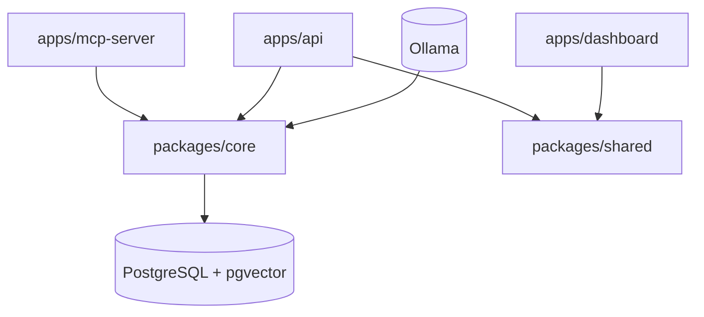
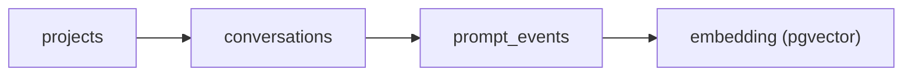
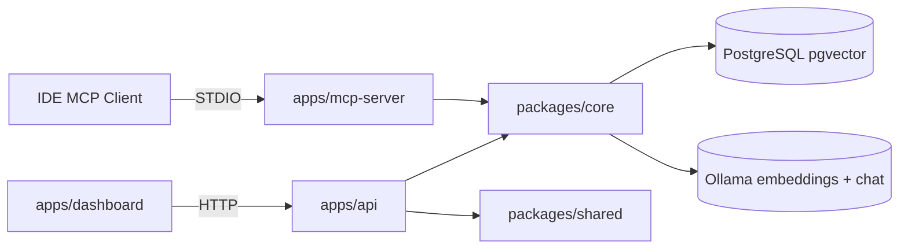

# Plan SDD por fases (MCP-first y ahorro de tokens)

## Decisiones cerradas

- Interceptación en **modo MCP-first** (sin proxy global), compatible multi-IDE (`Cursor`, `Claude Code`, `OpenCode`, VS Code con cliente MCP).
- Base relacional en **PostgreSQL local** con extensión **pgvector** (sin Qdrant en la implementación actual).
- **Monorepo pnpm** (`apps/*`, `packages/*`); sin Nx.
- Lógica de negocio compartida en **`@contextforge/core`**; contrato REST en **`@contextforge/shared`**.
- Objetivo principal: **minimizar tokens y costo** por interacción sin perder calidad de respuesta.
- Retención en `prompt_events`: **ilimitada**.
- Estrategia de vectorización: **solo resúmenes** (`is_summary=true`); embeddings en columna `prompt_events.embedding`.
- **API HTTP** separada del MCP (`apps/api`) para observabilidad y futuro dashboard Angular.
- `.env` en la **raíz del repo**; apps lo cargan vía `--env-file=../../.env`.

## Alcance

- **Fase 1 (MVP):** capturar contexto, recuperar memoria del proyecto, enriquecer prompt, persistir aprendizaje vía MCP.
- **Fase 1.5 (hecho):** monorepo + API REST de observabilidad.
- **Fase 1.55 (hecho):** gaps API para dashboard + mejoras de schema UX ([improves.md](improves.md)); spec de `knowledge_entries` ([knowledge-entries.md](knowledge-entries.md)) sin implementar tabla aún.
- **Fase 1.6 (pendiente):** dashboard Angular en `apps/dashboard`.
- **Fase 2:** subagentes por tarea para repartir contexto y devolver síntesis compacta.
- **Fase 2+ (diseño):** capa `knowledge_entries` (memoria curada separada del historial).

## Estructura del proyecto (actual)

```text
ContextForge/
├── pnpm-workspace.yaml       # apps/* + packages/*
├── package.json              # @contextforge/root — build, dev, db:init/smoke/e2e
├── tsconfig.base.json        # opciones TS compartidas
├── .prettierrc               # Prettier global
├── .prettierignore
├── .env                      # variables compartidas (raíz)
├── AGENTS.md                 # índice para agentes (estructura, verificación, skills)
├── plans/
│   ├── specifications.md     # este archivo
│   ├── improves.md           # mejoras de schema/UX (model, title, knowledge_entries)
│   ├── improvements2.md      # layout monorepo (schema en core; knowledge/dashboard diferidos)
│   ├── knowledge-entries.md  # spec ingestión/búsqueda (implementación pendiente)
│   └── resumenes-llm-ollama.md
├── skills/                   # skills del proyecto (nestjs, pnpm, antfu, postgresql…)
│
├── packages/
│   ├── core/                 # @contextforge/core — lógica compartida + schema DB
│   │   ├── scripts/
│   │   │   └── db-init.ts    # pnpm db:init
│   │   └── src/
│   │       ├── common/       # tipos y utils compartidos
│   │       ├── config/       # token-budget, summary
│   │       ├── persistence/
│   │       │   ├── database/schema.sql
│   │       │   ├── postgres/ # PostgresService, PostgresModule
│   │       │   └── pgvector/ # PgVectorService, PgVectorModule
│   │       ├── enrichment/   # embedding, summary LLM, persistencia, retrieval
│   │       ├── retrieval/    # ContextRetrievalService, SummaryService
│   │       └── index.ts      # barrel público del paquete
│   │
│   └── shared/               # @contextforge/shared — DTOs REST (API ↔ Angular)
│       └── src/
│           ├── project.dto.ts
│           ├── conversation.dto.ts
│           ├── prompt-event.dto.ts
│           ├── stats.dto.ts
│           ├── search.dto.ts
│           ├── summary.dto.ts
│           ├── health.dto.ts
│           └── index.ts        # re-exports (sin definir tipos inline)
│
└── apps/
    ├── mcp-server/           # @contextforge/mcp-server — MCP STDIO
    │   └── src/
    │       ├── main.ts       # createApplicationContext, transport STDIO
    │       ├── app.module.ts
    │       ├── mcp/
    │       │   ├── mcp.module.ts
    │       │   ├── schemas/  # Zod (validación MCP)
    │       │   ├── types/    # tipos inferidos de schemas
    │       │   └── tools/    # 4 MCP tools
    │       └── scripts/      # smoke-test, smoke-summary, smoke-helpers
    │
    ├── api/                  # @contextforge/api — NestJS HTTP REST
    │   └── src/
    │       ├── main.ts       # app.listen(), prefix /api
    │       ├── app.module.ts
    │       ├── health/       # HealthModule
    │       ├── stats/        # StatsModule
    │       └── projects/     # ProjectsModule
    │
    └── dashboard/            # (futuro) Angular observabilidad
```

### Flujo de dependencias



### Scripts del workspace (`package.json`)

**Raíz (`@contextforge/root`):**

| Script | Descripción |
|--------|-------------|
| `pnpm build` | Build core → shared → mcp-server → api |
| `pnpm build:core` | Solo `@contextforge/core` |
| `pnpm dev:mcp` | MCP server en dev (ts-node) |
| `pnpm dev:api` | API HTTP en dev (puerto `API_PORT`, default 3000) |
| `pnpm db:init` | Schema idempotente vía `@contextforge/core` |
| `pnpm db:smoke` | Conectividad + validación schema/pgvector |
| `pnpm test:e2e` | Pipeline completo (requiere Ollama) |
| `pnpm format` | Prettier en todo el monorepo |

Orden tras cambios de schema: **`db:init` → `db:smoke` → `test:e2e`**.

**Por paquete:**

| Paquete | Scripts |
|---------|---------|
| `@contextforge/core` | `build`, `db:init` |
| `@contextforge/shared` | `build` |
| `@contextforge/mcp-server` | `build`, `start`, `start:dev`, `db:init` (delega a core), `db:smoke`, `test:e2e` |
| `@contextforge/api` | `build`, `start`, `start:dev` |

Requisito infra local: PostgreSQL 16+ con pgvector en `POSTGRES_*`; sin servicio activo, `db:init`/`db:smoke` fallan con `ECONNREFUSED`.

### Smoke tests y DB init

| Script | Comando | Ubicación | Qué valida |
|--------|---------|-----------|------------|
| `db-init.ts` | `pnpm db:init` | `packages/core/scripts/` | Aplica `schema.sql`; verifica extensiones, 3 tablas, HNSW, `projects_name_unique`, `conversations.model/title` |
| `smoke-test.ts` | `pnpm db:smoke` | `apps/mcp-server/src/scripts/` | `postgres:connect`, tablas, `schema:projects-name-unique`, `schema:conversations-model/title`, `pgvector:extension`, `embedding`, `hnsw-index` |
| `smoke-summary.ts` | `pnpm test:e2e` | `apps/mcp-server/src/scripts/` | Reset CASCADE, persist 9 turnos, resumen LLM, embeddings, búsqueda, `conversation:model/title`, KPI reducción ≥ 30% |

Pasos de `db:smoke` (si Postgres disponible): `postgres:connect` → `postgres:tables` → schema → pgvector (7 checks en total).

Requisitos: PostgreSQL 16+ con pgvector (`POSTGRES_*` en `.env`); Ollama accesible para `test:e2e` (`OLLAMA_*`, embeddings + chat).

## Organización de tipos y contratos

| Capa | Ubicación | Contiene |
|------|-----------|----------|
| Core compartido | `packages/core/src/common/types/` | `ContextSearchResult`, `CompressedContext` |
| Persistencia | `packages/core/src/persistence/types/` | Contratos Postgres y pgvector |
| Retrieval | `packages/core/src/retrieval/types/` | Búsqueda y resúmenes |
| Enrichment | `packages/core/src/enrichment/types/` | Enriquecimiento y persistencia |
| REST (API ↔ UI) | `packages/shared/src/*.dto.ts` | DTOs HTTP (`ProjectDto`, `ConversationDto`, …) |
| Borde MCP (schemas) | `apps/mcp-server/src/mcp/schemas/` | Esquemas Zod |
| Borde MCP (tipos) | `apps/mcp-server/src/mcp/types/` | `z.infer` y outputs de tools |

Reglas:

- **`@contextforge/core`**: servicios NestJS, módulos globales (`PostgresModule`, `PgVectorModule`, `EnrichmentModule`), utilidades. Export vía `packages/core/src/index.ts`.
- **`@contextforge/shared`**: solo tipos/DTOs del contrato REST; un archivo por entidad; `index.ts` solo re-exporta.
- **`apps/mcp-server`**: borde MCP (tools, schemas, scripts). `McpServerModule` importa `EnrichmentModule` para DI de tools.
- **`apps/api`**: controllers + services por feature module. Importa `@contextforge/core` y `@contextforge/shared`.
- Servicios `@Injectable` en core no exportan contratos desde archivos de servicio; tipos viven en `{module}/types/` o en `shared`.

### TypeScript y path aliases

**Base:** `tsconfig.base.json` (sin `types: node` global).

| Paquete/App | Config | Notas |
|-------------|--------|-------|
| `packages/core` | `tsconfig.json` | `composite: true`, emite `dist/` + `.d.ts` |
| `packages/shared` | `tsconfig.json` | `composite: true`, sin `@types/node` |
| `apps/mcp-server` | `tsconfig.json` + `tsconfig.dev.json` | Project reference → core; dev usa paths a source de core |
| `apps/api` | `tsconfig.json` + `tsconfig.dev.json` | Project references → core + shared |

**Aliases locales (solo en apps):**

| Alias | App | Resuelve a |
|-------|-----|------------|
| `@mcp/*` | mcp-server | `src/mcp/*` |
| `@app/*` | mcp-server | `src/*` |
| `@api/*` | api | `src/*` |

**Dependencias workspace:** `"@contextforge/core": "workspace:*"` en `package.json` de cada app.

**Build apps:** `tsc` + `tsc-alias`. **Dev:** `TS_NODE_PROJECT=tsconfig.dev.json` + `tsconfig-paths/register`.

### MCP tools (`apps/mcp-server`)

| Tool | Rol |
|------|-----|
| `search_project_context` | Búsqueda semántica + `contextBlock` con presupuesto de tokens |
| `save_interaction_memory` | Persistir turno (`model?`, `title?` opcionales); dispara resumen + embedding si umbral |
| `list_project_memory` | Inspección read-only de memoria del proyecto |
| `delete_project_memory` | Borrado completo del proyecto (CASCADE) |

### API REST (`apps/api`, prefijo `/api`)

| Método | Ruta | Descripción |
|--------|------|-------------|
| `GET` | `/health` | Liveness; ping a PostgreSQL |
| `GET` | `/stats` | Estadísticas globales |
| `GET` | `/projects` | Listar proyectos |
| `GET` | `/projects/:id` | Detalle de proyecto |
| `GET` | `/projects/:id/stats` | Contadores del proyecto |
| `GET` | `/projects/:id/conversations` | Conversaciones del proyecto |
| `GET` | `/projects/:id/events?limit=&offset=&conversationId=` | Eventos recientes (paginados, filtro opcional por conversación) |
| `GET` | `/projects/:id/summaries?limit=` | Resúmenes indexados en pgvector (paridad MCP `vectorPoints`) |
| `GET` | `/projects/:id/search?q=` | Búsqueda semántica (misma lógica que MCP) |
| `DELETE` | `/projects/:id` | Borrado completo del proyecto (CASCADE) |

Organización NestJS: módulos por feature (`HealthModule`, `StatsModule`, `ProjectsModule`); módulos globales de core importados una vez en `AppModule`.

### DTOs REST (`@contextforge/shared`)

| DTO | Campos principales |
|-----|-------------------|
| `ProjectDto` | `id`, `name`, `createdAt` |
| `ConversationDto` | `id`, `provider`, `model`, `title`, `userName`, `createdAt`, `updatedAt`, `eventCount`, `summaryCount` |
| `PromptEventDto` | `id`, `conversationId`, `role`, `content`, `isSummary`, `createdAt` |
| `IndexedSummaryDto` | `id`, `conversationId`, `provider`, `userName`, `content`, `createdAt` |
| `ProjectStatsDto` / `GlobalStatsDto` | Contadores de conversaciones, eventos, resúmenes |
| `SearchResponseDto` | `results`, `contextBlock`, `snippetCount`, `tokensUsed`, `truncated` |
| `HealthDto` | `status`, `timestamp` |

Límites API: eventos `limit` 1–200 (default 50), `offset` ≥ 0; resúmenes `limit` 1–500 (default 100).

### Embeddings (proveedor configurable)

- Default dev: **Ollama** (`EMBEDDING_PROVIDER=ollama`, `nomic-embed-text`, 768 dims).
- Producción opcional: **OpenAI** (`EMBEDDING_PROVIDER=openai`, `text-embedding-3-small`, 1536 dims).
- Dimensión alineada con columna `prompt_events.embedding vector(768)` en schema (ajustar si cambia modelo).

## Modelos de tablas PostgreSQL (Fase 1)

Schema aplicable: [packages/core/src/persistence/database/schema.sql](../packages/core/src/persistence/database/schema.sql) (`pnpm db:init` desde raíz o `@contextforge/core`).

### Principios de diseño

- Minimizar tablas y campos: persistir solo lo imprescindible para enriquecer prompts.
- Evitar complejidad temprana: métricas avanzadas y cache semántica en iteraciones posteriores.
- Preparar migración cloud: IDs UUID, timestamps UTC y relaciones simples.

### 1) `projects`

- **Objetivo:** identificar el proyecto.
- **Campos:** `id` UUID PK, `name` VARCHAR(180) UNIQUE, `created_at` TIMESTAMPTZ.

### 2) `conversations`

- **Objetivo:** agrupar eventos por sesión de trabajo.
- **Campos:** `id`, `project_id` FK, `provider`, `model`, `title` (nullable), `user_name`, `created_at`, `updated_at`.
- **Índices:** `(project_id, created_at DESC)`.
- **`model`:** NOT NULL, default `'unknown'` en DB; al persistir vía MCP usa `OLLAMA_CHAT_MODEL` si el cliente no envía `model`.
- **`title`:** nullable; el cliente MCP puede enviar `title`; si no, se deriva del primer turno `user` (`conversationTitleFromContent` en core).

### 3) `prompt_events`

- **Objetivo:** guardar cada turno y resúmenes.
- **Campos:** `id`, `conversation_id` FK, `role`, `content`, `is_summary`, `created_at`, **`embedding vector(768)`** (nullable; solo resúmenes indexados).
- **Índices:** `(conversation_id, created_at ASC)`, `(conversation_id, is_summary)`, HNSW cosine en `embedding` donde `is_summary=true`.
- **Retención:** ilimitada.

## Estrategia de indexación vectorial (pgvector)

> **Nota:** el plan original contemplaba Qdrant; la implementación usa **pgvector dentro de PostgreSQL**.

- Embeddings en **`prompt_events.embedding`** solo para filas con `is_summary=true`.
- Búsqueda: cosine distance (`<=>`) vía `PgVectorService.searchSummaries`.
- Metadatos de conversación/proyecto: JOIN con `conversations` / `projects` (no payload Qdrant separado).
- `summary_kind` (`rolling`, `milestone`, `final`) se usa en lógica de indexación, no como columna DB.

### Reglas de indexación

- Se genera embedding **solo** para eventos con `is_summary=true` (resúmenes rolling o milestone).
- No se indexan turnos `user` / `assistant` crudos.
- Umbrales de resumen rolling:
  - `SUMMARY_TURN_THRESHOLD` (default 8), o
  - `SUMMARY_TOKEN_THRESHOLD` (default 4000 tokens estimados).

### Generación de resumen (LLM Ollama rolling)

- **Servicio:** `SummaryLlmService` en `packages/core/src/enrichment/`.
- **Config:** `OLLAMA_CHAT_MODEL` (default `qwen3:4b`), `SUMMARY_MAX_OUTPUT_TOKENS`, `SUMMARY_LLM_TIMEOUT_MS`.
- **Fail-open:** fallo LLM no bloquea `save_interaction_memory`.
- Detalle: [resumenes-llm-ollama.md](resumenes-llm-ollama.md).

### Tolerancia a fallos (indexación)

- Fallo al escribir embedding → log + cola de reintento en `PgVectorService`.
- Borrado de proyecto → CASCADE en Postgres (embeddings incluidos).

### Búsqueda (`search_project_context` / API search)

- Filtro por `project_id` (vía nombre de proyecto → UUID determinista).
- Filtro opcional por `conversation_id`.
- `topK` adaptativo (3 → 5 si baja confianza); umbral `SCORE_THRESHOLD`.
- Presupuesto `MAX_CONTEXT_TOKENS`; snippets resumidos, nunca turnos crudos completos.

## Relaciones clave



### Evolución planificada: `knowledge_entries`

No implementado aún. Spec en [knowledge-entries.md](knowledge-entries.md): tabla separada para conocimiento consolidado (facts/decisiones), con pipeline de extracción desde resúmenes milestone y búsqueda complementaria o sustitutiva de `prompt_events.embedding`. Ver también [improves.md](improves.md).

## Arquitectura runtime



## Checklist técnico

### Fase 1 — MVP MCP (completada)

- [x] PostgreSQL + pgvector + schema (`projects`, `conversations`, `prompt_events`, HNSW).
- [x] `.env` raíz con `POSTGRES_*`, `OLLAMA_*`, `EMBEDDING_*`, `TOPK_*`, `SUMMARY_*`.
- [x] MCP server NestJS STDIO con 4 tools.
- [x] Resúmenes LLM rolling + embeddings solo en `is_summary=true`.
- [x] Retrieval adaptativo + compresión con presupuesto de tokens.
- [x] Smoke tests: `db:smoke`, `test:e2e` (smoke-summary); KPI reducción contexto ≥ 30%.

### Fase 1.5 — Monorepo + API (completada)

- [x] `pnpm-workspace.yaml` + root `package.json`.
- [x] `packages/core` con servicios extraídos del mcp-server.
- [x] `packages/shared` con DTOs REST por archivo.
- [x] `apps/api` HTTP con módulos por feature y health check con ping DB.
- [x] TypeScript project references + builds composite.
- [x] Prettier global en raíz.

### Fase 1.55 — API dashboard + schema UX (completada)

- [x] `ProjectDto.createdAt`; `ConversationDto.model` + `title`; `IndexedSummaryDto`.
- [x] API: `GET /projects/:id/summaries`, paginación/filtro en `/events`, `DELETE /projects/:id`.
- [x] Schema: `projects.name` UNIQUE; `conversations.model` + `title`.
- [x] MCP `save_interaction_memory`: campos opcionales `model`, `title`; auto-título desde primer turno `user`.
- [x] `McpServerModule` importa `EnrichmentModule` (DI correcta en smokes y runtime).
- [x] Smokes ampliados: schema nuevo, HNSW, `model`/`title`, errores de conexión claros.
- [x] Spec `knowledge_entries` documentada; tabla **no** creada.

### Fase 1.56 — Layout monorepo ([improvements2.md](improvements2.md), completada)

- [x] `schema.sql` en `packages/core/src/persistence/database/`.
- [x] `db:init` en `@contextforge/core` (`packages/core/scripts/db-init.ts`).
- [x] Sin módulo `knowledge/` ni `KnowledgeEntryDto` hasta pipeline Fase 2+.
- [x] Sin scaffold `apps/dashboard/` hasta Fase 1.6 Angular.

### Pendiente

- [ ] `docker-compose.yml` en repo (Postgres + pgvector + Ollama) — hoy infra manual/local.
- [ ] `apps/dashboard` Angular consumiendo `@contextforge/shared`.
- [ ] Implementar `knowledge_entries` según [knowledge-entries.md](knowledge-entries.md).
- [ ] Fase 2: orquestación subagentes (ver abajo).

## Fase 2: subagentes por tarea (reparto de contexto)

### 1) Orquestación Supervisor-Workers

- Grafo de tareas con Supervisor; workers por dominio (`security`, `performance`, `testing`, `docs`).
- Ubicación prevista: `packages/core/src/orchestration/` o app dedicada según evolucione el monorepo.

### 2) Síntesis final compacta

- Consolidar salidas de workers en resumen de alta densidad; prohibir volcado crudo al hilo principal.

### 3) Métricas comparativas Fase 1 vs Fase 2

- Medir tokens, costo y calidad; documentar en `docs/phase2-evaluation.md` (pendiente).

## Estrategia de migración futura a cloud

- Capa de acceso en `packages/core` desacoplada del transporte (MCP vs HTTP).
- Postgres cloud compatible; mismo schema + pgvector.
- Script export/import y migraciones versionadas (pendiente).

## Riesgos y mitigaciones

- **Subagentes demasiado pronto:** bloquear Fase 2 hasta KPIs Fase 1 estables.
- **Contexto excesivo:** token budget + topK adaptativo + compresión.
- **Lock-in LLM:** `EmbeddingService` con adapter Ollama/OpenAI.
- **Drift documentación ↔ código:** mantener este archivo alineado tras cambios estructurales.
