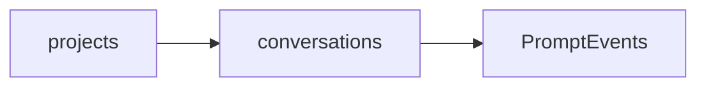
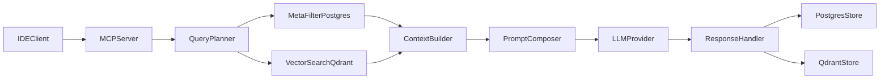

# Plan SDD por fases (MCP-first y ahorro de tokens)

## Decisiones cerradas

- Interceptación en **modo MCP-first** (sin proxy global), para mantener compatibilidad multi-IDE (`Cursor`, `Claude Code`, `OpenCode`, VS Code con cliente MCP).
- Base relacional en **PostgreSQL local (Docker)** en Fase 1, con diseño preparado para migración posterior a cloud.
- Objetivo principal: **minimizar tokens y costo** por interacción sin perder calidad de respuesta.
- Retención en `prompt_events`: **ilimitada** (máxima trazabilidad histórica).
- Estrategia de vectorización Fase 1: **solo resúmenes útiles de conversación** (sin tabla extra de conocimiento en esta fase).

## Alcance

- **Fase 1 (MVP):** capturar contexto del prompt, recuperar conocimiento existente del proyecto, enriquecer contexto, responder y persistir aprendizaje.
- **Fase 2:** introducir subagentes por tarea para repartir contexto y devolver síntesis compacta al agente principal.

## Estructura del proyecto (propuesta base)

```text
ContextForge/
  docker-compose.yml
  .env.example
  docs/
    architecture.md
    mvp-kpis.md
  apps/
    mcp-server/
      package.json
      tsconfig.json
      src/
        main.ts
        app.module.ts
        config/
          env.validation.ts
          token-budget.config.ts
        mcp/
          mcp.module.ts
          tools.registry.ts
          dto/
            search-project-context.dto.ts
            save-interaction-memory.dto.ts
          tools/
            search-project-context.tool.ts
            save-interaction-memory.tool.ts
        retrieval/
          query-normalizer.service.ts
          vector-retrieval.service.ts
          context-compression.service.ts
          prompt-enrichment.service.ts
        persistence/
          postgres/
            db.module.ts
            schema.sql
            migrations/
          qdrant/
            qdrant.module.ts
            qdrant.service.ts
        common/
          types/
          utils/
          constants/
      test/
        unit/
        e2e/
          prompt-flow.e2e-spec.ts
```

## Modelos de tablas PostgreSQL (Fase 1)

### Principios de diseño

- Minimizar tablas y campos: persistir solo lo imprescindible para enriquecer prompts.
- Evitar complejidad temprana: métricas avanzadas, cache semántica y logs detallados pasan a una fase posterior.
- Preparar migración cloud: IDs UUID, timestamps UTC y relaciones simples.

### 1) `projects`

- **Objetivo:** identificar el proyecto.
- **Campos:**
  - `id` UUID PK
  - `name` VARCHAR(180) NOT NULL
  - `created_at` TIMESTAMPTZ NOT NULL DEFAULT now()
- **Índices:** `(name)` opcional si quieres evitar duplicados por nombre

### 2) `conversations`

- **Objetivo:** agrupar eventos de prompt/respuesta por sesión de trabajo.
- **Campos:**
  - `id` UUID PK
  - `project_id` UUID NOT NULL FK -> `projects.id`
  - `provider` VARCHAR(80) NOT NULL (`cursor`, `claude-code`, `opencode`, etc.)
  - `user_name` VARCHAR(120) NOT NULL
  - `created_at` TIMESTAMPTZ NOT NULL DEFAULT now()
  - `updated_at` TIMESTAMPTZ NOT NULL DEFAULT now()
- **Índices:** `(project_id, created_at DESC)`

### 3) `prompt_events`

- **Objetivo:** guardar cada turno de conversación de forma simple.
- **Campos:**
  - `id` UUID PK
  - `conversation_id` UUID NOT NULL FK
  - `role` VARCHAR(20) NOT NULL (`user`, `assistant`, `system`)
  - `content` TEXT NOT NULL
  - `is_summary` BOOLEAN NOT NULL DEFAULT false
  - `created_at` TIMESTAMPTZ NOT NULL DEFAULT now()
- **Índices:** `(conversation_id, created_at ASC)`, `(conversation_id, is_summary)`
- **Política de retención:** ilimitada (con opción futura de archivado en frío por partición temporal).

## Estrategia de indexación vectorial (Fase 1 simplificada)

- Indexar en Qdrant únicamente:
  - eventos `prompt_events` con `is_summary=true`.
- Generación de resumen:
  - cada X turnos, crear un resumen corto y accionable y guardarlo como `prompt_event` resumido.
- No indexar por defecto:
  - turnos crudos completos.
- Beneficio esperado:
  - buena precisión inicial con complejidad baja y costo de embeddings controlado.

### Especificación Qdrant (cerrada para Fase 1)

- **Colección única:** `conversation_summaries`
- **Distance metric:** `Cosine`
- **Vector size:** definido por el modelo de embeddings elegido en runtime (variable de entorno).
- **Punto Qdrant (`id`):**
  - usar el mismo UUID de `prompt_events.id` cuando `is_summary=true`.
- **Payload obligatorio:**
  - `project_id` (UUID)
  - `conversation_id` (UUID)
  - `provider` (string)
  - `user_name` (string)
  - `created_at` (timestamp ISO)
  - `is_summary` (bool, siempre `true` en esta colección)
- **Payload opcional:**
  - `summary_kind` (`rolling`, `milestone`, `final`)
  - `tags` (array string)

### Reglas de indexación (deterministas)

- Se indexa **solo** cuando se crea un `prompt_event` con:
  - `role='system'`
  - `is_summary=true`
- No se indexa:
  - `role='user'` o `role='assistant'`
  - cualquier evento con `is_summary=false`
- Frecuencia recomendada de resumen:
  - cada 8 turnos, o
  - cuando el acumulado estimado supere 4k tokens en la conversación.

### Sincronización Postgres <-> Qdrant

- **Insert resumen en Postgres exitoso** -> generar embedding -> upsert en Qdrant.
- Si falla Qdrant:
  - no romper conversación; registrar error en log de aplicación y reintentar en background.
- Si se elimina conversación/proyecto:
  - borrar en cascada en Postgres y ejecutar borrado por filtro en Qdrant (`project_id` / `conversation_id`).
- Clave de consistencia:
  - `prompt_events.id` como ID canónico también en Qdrant.

### Búsqueda (search_project_context)

- Filtro obligatorio por `project_id`.
- Filtro opcional por `conversation_id` (si la consulta es muy local a una conversación).
- `topK` inicial bajo (ej. 3) y subir a 5 solo si la confianza semántica cae bajo umbral.
- Devolver fragmentos resumidos, nunca turnos crudos completos.

## Relaciones clave (resumen)




## Arquitectura objetivo




## Fase 1: MVP SDD (portable y costo mínimo)

## Checklist técnico de ejecución (Fase 1)

- [ ] **Infra local**
  - [ ] Crear `docker-compose.yml` con PostgreSQL y Qdrant.
  - [ ] Crear `.env.example` con variables mínimas (`POSTGRES_`*, `QDRANT_URL`, `EMBEDDING_MODEL`, `TOPK_DEFAULT`).
  - [ ] Verificar conectividad desde el servidor MCP a ambos servicios.

- [ ] **Modelo de datos mínimo (PostgreSQL)**
  - [ ] Crear tabla `projects` (`id`, `name`, `created_at`).
  - [ ] Crear tabla `conversations` (`id`, `project_id`, `provider`, `user_name`, `created_at`, `updated_at`).
  - [ ] Crear tabla `prompt_events` (`id`, `conversation_id`, `role`, `content`, `is_summary`, `created_at`).
  - [ ] Definir FKs e índices base:
    - [ ] `conversations.project_id -> projects.id`
    - [ ] `prompt_events.conversation_id -> conversations.id`
    - [ ] índice `(conversation_id, created_at ASC)`
    - [ ] índice `(conversation_id, is_summary)`

- [ ] **MCP server base (NestJS)**
  - [ ] Inicializar servidor MCP (tool-first).
  - [ ] Registrar tools:
    - [ ] `save_interaction_memory`
    - [ ] `search_project_context`
  - [ ] Definir DTOs mínimos de entrada/salida para ambas tools.

- [ ] **Qdrant ajustado (colección única)**
  - [ ] Crear colección `conversation_summaries` (Cosine).
  - [ ] Configurar `vector_size` desde `EMBEDDING_MODEL`.
  - [ ] Definir payload obligatorio:
    - [ ] `project_id`, `conversation_id`, `provider`, `user_name`, `created_at`, `is_summary=true`.

- [ ] **Regla de resumen e indexación (determinista)**
  - [ ] Guardar turnos normales con `is_summary=false`.
  - [ ] Generar resumen (`role=system`, `is_summary=true`) cada 8 turnos o >4k tokens estimados.
  - [ ] Indexar en Qdrant solo eventos con `is_summary=true`.
  - [ ] Usar `prompt_events.id` como `id` del punto en Qdrant.

- [ ] **Flujo de recuperación de contexto**
  - [ ] En `search_project_context`, filtrar siempre por `project_id`.
  - [ ] Aplicar filtro opcional por `conversation_id` cuando la consulta sea local.
  - [ ] Ejecutar búsqueda con `topK=3` (subir a `5` si confianza baja).
  - [ ] Devolver únicamente snippets resumidos (nunca turnos crudos completos).

- [ ] **Sincronización y tolerancia a fallos**
  - [ ] Si falla Qdrant al indexar, no romper la conversación.
  - [ ] Registrar error y encolar reintento en background.
  - [ ] Al eliminar conversación/proyecto, borrar también puntos asociados en Qdrant por filtro.

- [ ] **Validación de cierre Fase 1**
  - [ ] Probar ciclo completo: IDE -> `save_interaction_memory` -> resumen -> indexación -> `search_project_context`.
  - [ ] Verificar que solo `is_summary=true` entra en Qdrant.
  - [ ] Verificar reducción de contexto inyectado >= 30% frente a baseline sin retrieval selectivo.

### 1) Infraestructura local base

- Crear `docker-compose` con PostgreSQL y Qdrant.
- Definir variables en `.env.example` para puertos, credenciales y límites de retrieval.
- Entregables:
  - [docker-compose.yml](docker-compose.yml)
  - [.env.example](.env.example)

### 2) Esquema de datos mínimo para memoria útil y barata

- Diseñar tablas mínimas en PostgreSQL para no sobredimensionar costo:
  - `projects`, `conversations`, `prompt_events`.
- Posponer métricas/caché avanzadas para una iteración 1.1.
- Entregables:
  - [apps/mcp-server/src/db/schema.sql](apps/mcp-server/src/db/schema.sql) o equivalente ORM
  - [apps/mcp-server/src/db/migrations/](apps/mcp-server/src/db/migrations/)

### 3) Servidor MCP en NestJS (tool-first)

- Levantar servidor NestJS con transporte MCP.
- Implementar tools iniciales:
  - `search_project_context`
  - `save_interaction_memory`
- Mantener contratos simples y agnósticos de IDE.
- Entregables:
  - [apps/mcp-server/src/main.ts](apps/mcp-server/src/main.ts)
  - [apps/mcp-server/src/mcp/mcp.module.ts](apps/mcp-server/src/mcp/mcp.module.ts)
  - [apps/mcp-server/src/mcp/tools.registry.ts](apps/mcp-server/src/mcp/tools.registry.ts)

### 4) Pipeline de enriquecimiento de prompt con control de tokens

- Flujo:
  1. Normalizar consulta y extraer señales (proyecto, intención, stack).
  2. Filtro por metadatos en PostgreSQL (reducir candidatos antes de vector search).
  3. Búsqueda vectorial en Qdrant con `topK` bajo y umbral de similitud.
  4. Dedupe de chunks por hash.
  5. Compresión/síntesis de contexto con presupuesto estricto de tokens.
  6. Composición de prompt final (contexto mínimo útil).
  7. Persistencia post-respuesta (memoria y métricas).
- Entregables:
  - [apps/mcp-server/src/services/context-retrieval.service.ts](apps/mcp-server/src/services/context-retrieval.service.ts)
  - [apps/mcp-server/src/services/context-compression.service.ts](apps/mcp-server/src/services/context-compression.service.ts)
  - [apps/mcp-server/src/services/prompt-enrichment.service.ts](apps/mcp-server/src/services/prompt-enrichment.service.ts)

### 5) Reglas explícitas de ahorro de tokens (obligatorias)

- Presupuesto por llamada (hard limit): `maxContextTokens`.
- Prioridad de fuentes: decisiones > código reciente > docs largas.
- `topK` adaptativo (mínimo por defecto, crecer sólo si baja confianza).
- Evitar persistir ruido: guardar turnos y resúmenes; no crear tablas adicionales en Fase 1.
- Entregable:
  - [apps/mcp-server/src/config/token-budget.config.ts](apps/mcp-server/src/config/token-budget.config.ts)

### 6) Validación de Fase 1 (Definition of Done)

- Pruebas E2E del ciclo: IDE -> MCP tool -> retrieval -> prompt enriquecido -> persistencia.
- KPI objetivo inicial:
  - reducción de tamaño de contexto inyectado >= 30% vs baseline sin retrieval selectivo.
  - p95 latencia de retrieval+composición <= 900ms local.
- Entregables:
  - [apps/mcp-server/test/e2e/prompt-flow.e2e-spec.ts](apps/mcp-server/test/e2e/prompt-flow.e2e-spec.ts)
  - [docs/mvp-kpis.md](docs/mvp-kpis.md)

## Fase 2: subagentes por tarea (reparto de contexto)

### 1) Orquestación Supervisor-Workers

- Introducir grafo de tareas con Supervisor.
- Workers especializados (ejemplo): `securityWorker`, `performanceWorker`, `testingWorker`, `docsWorker`.
- Cada worker recibe contexto mínimo específico de su dominio.
- Entregables:
  - [apps/mcp-server/src/orchestration/supervisor.graph.ts](apps/mcp-server/src/orchestration/supervisor.graph.ts)
  - [apps/mcp-server/src/orchestration/workers/](apps/mcp-server/src/orchestration/workers/)

### 2) Síntesis final compacta

- Consolidar salidas de workers en un resumen único de alta densidad informativa.
- Prohibir volcado completo de salidas crudas al hilo principal.
- Entregable:
  - [apps/mcp-server/src/orchestration/result-consolidator.service.ts](apps/mcp-server/src/orchestration/result-consolidator.service.ts)

### 3) Métricas comparativas Fase 1 vs Fase 2

- Medir impacto real en costo/tokens y calidad de respuesta.
- Entregable:
  - [docs/phase2-evaluation.md](docs/phase2-evaluation.md)

## Estrategia de migración futura a cloud

- Mantener capa de acceso a datos con interfaces para cambiar de Postgres local a Postgres cloud sin tocar lógica MCP.
- Preparar script de export/import y versionado de esquema.

## Riesgos y mitigaciones

- Riesgo: complejidad temprana de subagentes. Mitigación: bloquear Fase 2 hasta cumplir KPIs Fase 1.
- Riesgo: contexto excesivo por retrieval. Mitigación: token budget estricto + topK adaptativo + compresión.
- Riesgo: lock-in de proveedor LLM. Mitigación: adapter por proveedor y métricas homogéneas.